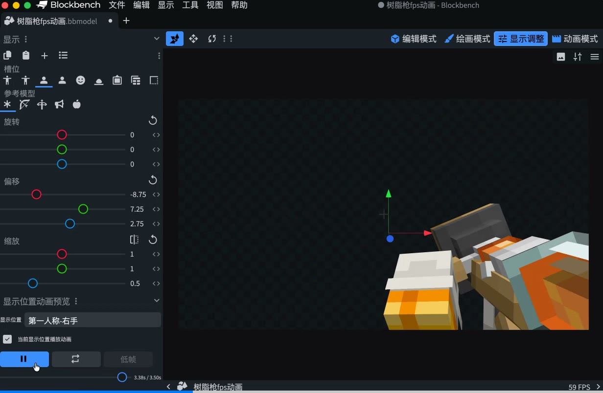
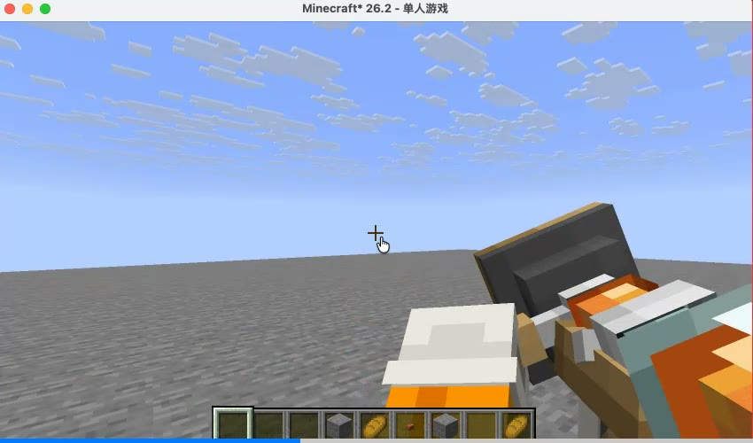
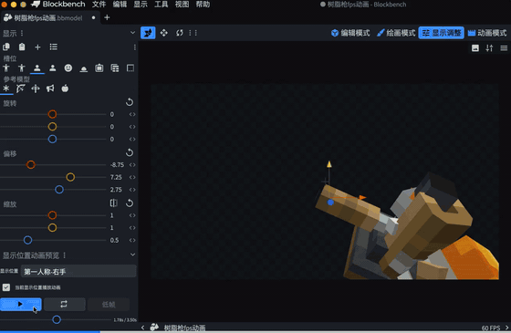
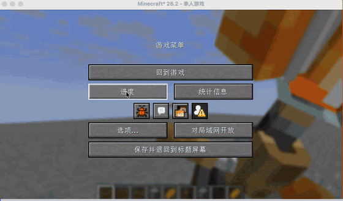
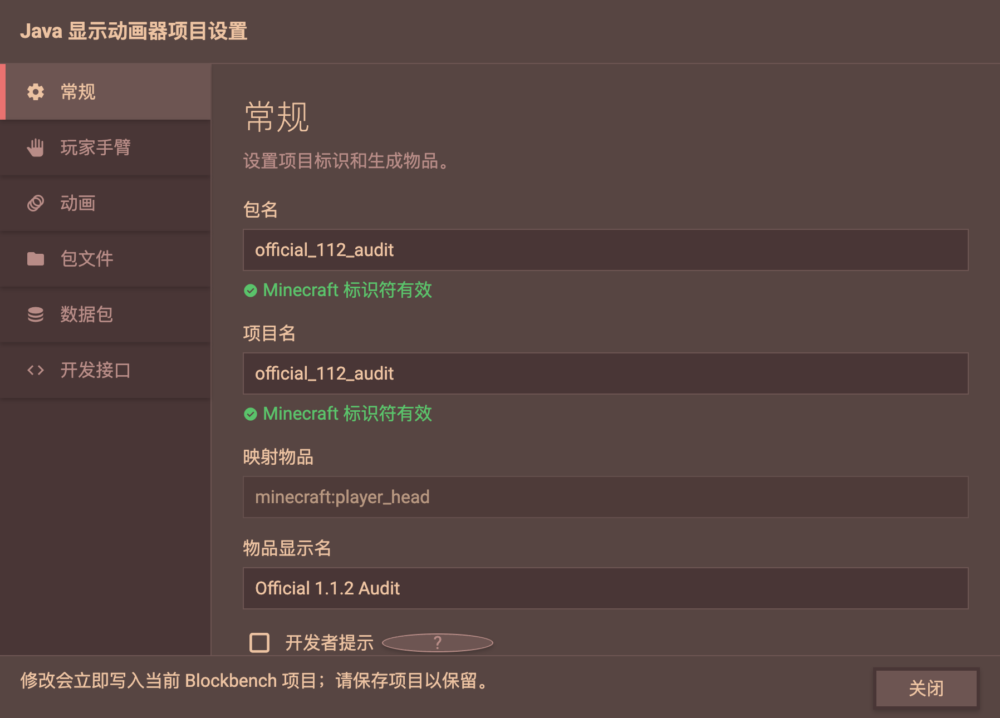
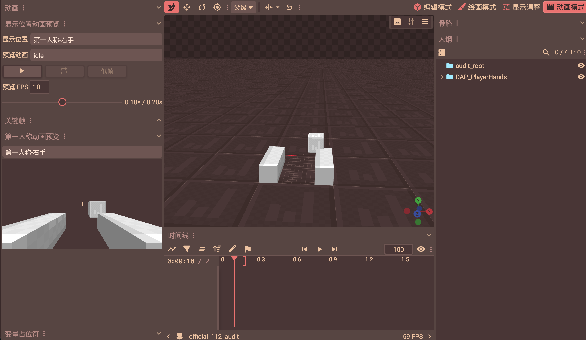

# Java Display Animator

[简体中文 · Java 帧物品动画](README.zh-CN.md)

Java Display Animator is a Blockbench plugin for creating, previewing, and exporting frame-baked
Minecraft Java item animations in the Desktop app. Configure animation playback independently for
first-person, third-person, GUI, and other display contexts, then export a resource pack and datapack together.

When making first-person hand-held item animations, you can animate the held item while keeping
third-person views or inventory icons still. These animations control the held item model itself.

  

**Version: 1.1.2.** Requires Blockbench Desktop 5.1.5+. Minecraft Java 26.2 is the version tested
during plugin development. Node.js 20+ is needed only to build from source.

See the [changelog](CHANGELOG.md) for update details. Plugin commands are grouped under
**Tools → Java Display Animator**. Pack export is also available under **File → Export**.

## Download

| Package | Language behavior |
|---|---|
| [Universal 1.1.2](https://github.com/rieyi/display-anim-preview/releases/download/v1.1.2/java-display-animator-v1.1.2-universal.zip) | English base interface; follows Blockbench's Simplified Chinese language setting |
| [Simplified Chinese 1.1.2](https://github.com/rieyi/display-anim-preview/releases/download/v1.1.2/java-display-animator-v1.1.2-zh-CN.zip) | Always uses Simplified Chinese |

Both packages provide the same features and share the `display_anim_preview` plugin ID. Install only one.

## Demos

  
  &nbsp;
  

  
  &nbsp;
  

  Left: Blockbench · Right: Minecraft

Open the full videos: [Blockbench preview](assets/blockbench-preview.mp4) ·
[Minecraft in-game result](assets/minecraft-result.mp4).

## Feature management, first-person animation preview, and player-skin arms

### Plugin feature management panel

Open **Tools → Java Display Animator → Java Display Animator Project Settings** to access a sidebar
window with six pages: General, Player Arms, Animations, Pack Files, Datapack, and Developer API.
Set item and project names, select animations and the default display, configure output locations,
and review generated command examples.

Changes update the current project's settings immediately. Save the `.bbmodel` to retain them on disk;
closing the panel does not save the model automatically.

### First-person preview while making animations

In **Animate** mode, the sidebar **First-person Animation Preview** shows the item's left- or right-hand
first-person view, making it easier to check the result while authoring an animation.

This image shows editor arm placeholders and the preview composition, rather than Minecraft's final skin rendering.

### Player-skin arms

Enable skin arms under **Project Settings → Player Arms** to create editable left/right arm bindings.
Animate their position and rotation alongside the item and preview their poses while authoring.

**Player-skin arms currently require Minecraft Java 1.21.11 or newer.** This feature relies on vanilla
core shaders and is incompatible with shader packs.

## Features

- **First-person preview:** Preview first-person item animations in Animate mode.
- **Player arms:** Create animated arms that display the player's skin. Skin arms rely on vanilla core shaders and are incompatible with shader packs.
- **Playback while authoring:** Play item animations in Edit, Paint, Animate, and Display modes,
  sharing playback, pause, loop, and time with Blockbench's official timeline.
- **Independent display animation switches:** Save animation switches separately for first-person,
  third-person, GUI, ground, head, item frame, and other display contexts. Disabled contexts remain on
  frame 0; for example, animate the first-person item while keeping its inventory icon still.
- **Resource-pack and datapack export:** Generate model resources and the matching animation driver
  together, or export only the resource pack or datapack.
- **Multiple animations and commands:** Select animation tracks and a default animation. Use short
  `play`, `loop`, `stop`, and `frame` commands, or select animations dynamically through the `play` / `frame` macro APIs.
- **1–20 FPS and model-frame deduplication:** A project frame rate controls preview, baking, bounds
  checks, and Minecraft playback. Deduplicate identical model frames across animations to reduce repeated files.
- **Pre-export checks:** Check model bounds, project/texture resolution, missing texture references,
  and particle textures.
- **Safe insertion into existing packs:** Create new packs or insert a project into existing unpacked
  packs. Manifests track generated project files; reinsertion updates managed files, blocks unmanaged
  path conflicts, and rolls back failed writes.
- **Independent item progress:** Each unstackable generated item keeps its own animation progress.
- **Project compatibility:** Preview and export already-open `java_block_sequence` projects, supporting
  compatible project formats from other plugins.

The resource pack uses `display_context` to select the display view, `custom_model_data.strings[0]`
to select an animation, and `custom_model_data.floats[0]` to select that animation's local frame.
Matching commands use the fixed `jsb` namespace. See the [complete usage guide](doc/USAGE.md).
Compatibility with `java_block_sequence` depends on an available Java model compiler in Blockbench;
the removed legacy model-sequence ZIP exporter is not provided.

## Install and quick start

- Search for **Java Display Animator** in Blockbench's official plugin browser.
- Alternatively, download the appropriate build from this repository's Releases.

1. Download one ZIP and extract it; do not load the ZIP itself as a plugin.
2. In **Blockbench → File → Plugins → Load Plugin from File**, select `display_anim_preview.js`.
3. Confirm **Java Display Animator** is installed. The fixed Simplified Chinese build is named **Java 逐帧显示动画**.
4. Create **File → New → Java Display Animation**, build and texture the item, and animate its groups in **Animate** mode.
5. Configure transforms in **Display** mode, then run **Open Display Animation Preview** from the Command Palette to set each display context's animation switch.
6. Open **Java Display Animator Project Settings** to configure animations, output locations, and other settings, then run **Export Resource Pack and Datapack**.
7. Enable the resource pack and install the datapack in Minecraft Java. Use the commands shown after export, starting with `/function jsb:<project>/give` to obtain the item.

## Guides and troubleshooting

- [Complete usage guide](doc/USAGE.md) · [Chinese guide](doc/USAGE.zh-CN.md)
- [Troubleshooting](doc/TROUBLESHOOTING.md) · [Chinese troubleshooting](doc/TROUBLESHOOTING.zh-CN.md)

## Version compatibility and limitations

In principle, this approach can support Minecraft Java versions that provide item-model mapping.
**Minecraft Java 26.2 is the version tested during plugin development and confirmed as a stable support target.**

Java model bounds still apply. Editor preview colors do not replace assigned textures. A datapack-only
export needs a matching resource pack with the same animation keys and frame mapping. Optional player-skin
arm animations rely on vanilla core shaders, are incompatible with shader packs, and do not support arm scaling.

## Credits and contributing

- Animation models provided by [镇川](https://space.bilibili.com/10016652?spm_id_from=333.337.0.0).
- Thanks to [毛豆](https://github.com/Sweda666) and [镇川](https://space.bilibili.com/10016652?spm_id_from=333.337.0.0) for testing and improvement suggestions.

Read the [contribution guidelines](CONTRIBUTING.md) before starting substantial changes or submitting
a Pull Request. Contributions use the controlled Fork + PR workflow.

## Copyright

Copyright © 2026 rieyi. All rights reserved. See [COPYRIGHT.md](COPYRIGHT.md).
